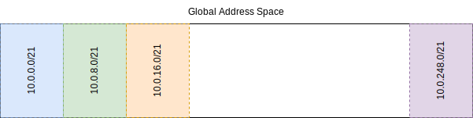

# Network Design
Each VPC is allocated a unique CIDR block. While this defeats the purpose of
private addressing, it allows the creation of arbitrary VPC peering connections
between any two VPC without the need to check if the VPC have overlapping CIDR
blocks.

## VPC
Each VPC use a /21 mask. No two VPC have overlapping CIDR blocks. A /21 mask
allows 32 VPC with globally unique addresses. This should be enough for
global presence while maintaining unique IPv4 addresses.

2043 addresses are available in each VPC.

## Subnets 
Subnets use a /24 mask which has 251 addresses. Each subnet is either public
or private. Each public subnet has a corresponding private subnet. There are
8 total subnets available (4 pairs) per VPC with this strategy.

Clients on a private subnet are able to initiate connections to servers on the
internet, but no client on the internet can initiate a connection with a server
in the private subnet. Data plane and backend components should go in a private
subnet.

Public subnets are exposed to the internet and are the appropriate location for
API and frontend components. Clients on the internet can initiate connections
with servers in public subnets.

## Critique
- This strategy wastes address space since VPC can have overlapping CIDR blocks